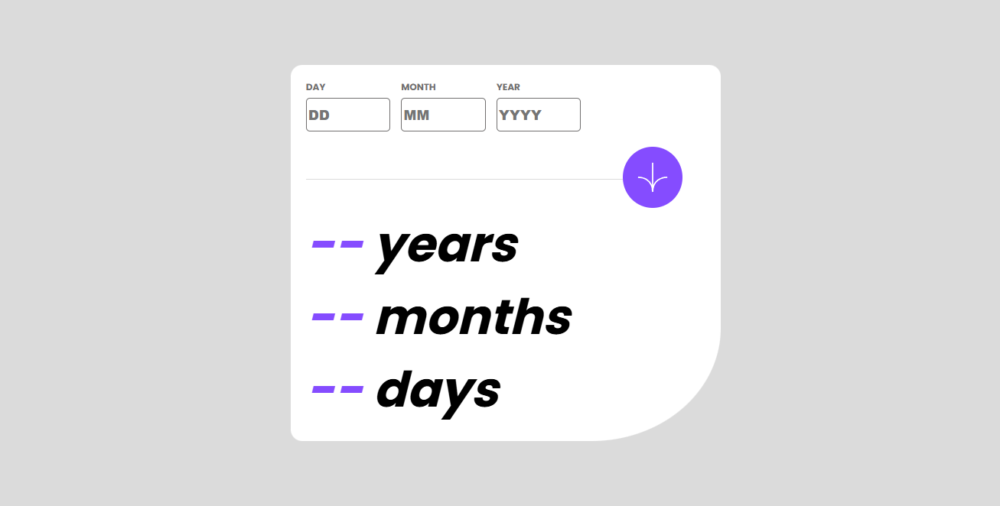
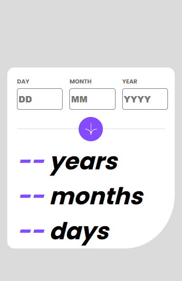

# Frontend Mentor - Age calculator app solution

This is a solution to the [Age calculator app challenge on Frontend Mentor](https://www.frontendmentor.io/challenges/age-calculator-app-dF9DFFpj-Q).

## Table of contents

- [Overview](#overview)
  - [The challenge](#the-challenge)
  - [Screenshot](#screenshot)
  - [Links](#links)
- [My process](#my-process)
  - [Built with](#built-with)
  - [What I learned](#what-i-learned)
  - [Continued development](#continued-development)

## Overview

### The challenge

Users should be able to:

- View an age in years, months, and days after submitting a valid date through the form
- Receive validation errors if:
  - Any field is empty when the form is submitted
  - The day number is not between 1-31
  - The month number is not between 1-12
  - The year is in the future
- View the optimal layout for the interface depending on their device's screen size
- See hover and focus states for all interactive elements on the page

### Screenshot

**Desktop design**

**Mobile design**

### Links

- Solution URL: [Repository](https://github.com/GregorioVeraza/age-caculator)
- Live Site URL: [live site](https://gregorioveraza.github.io/age-caculator)

## My process

### Built with

- HTML5
- CSS
- JavaScript

### What I learned

I learned mainly:
- how to handle **HTML forms entries** with JavaScript 
- how to handle **CSS styles** with JavaScript
- modify DOM elements, for instance to change texts

I am proud of how I modularized the code with functions and I tried to avoid duplicate code.

### Continued development
I think that there are some things which I can improve such as how I handle errors with strings instead of using error objects.